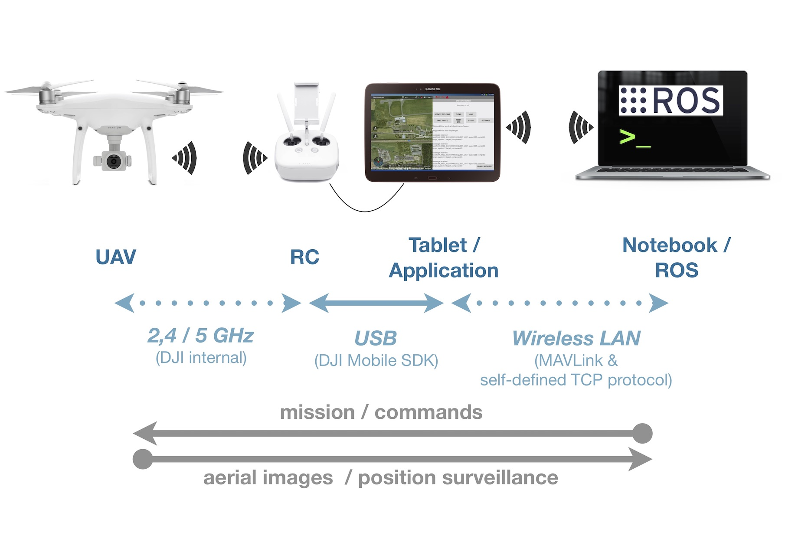

# Android:DJILink
The DJILink project allows to control a DJI-drone from ROS. It uses the "DJI Mobile SDK" in an Android-application and connects to ROS with the MAVLink-protocol. It also allows to receive aerial images from the drone while still in flight.

---
## Requirements
The Android device and your ROS-System have to be part of the same network. UDP- and TCP-connections have to be allowed.

This Android application connects to any compatible DJI-UAV via the DJI Mobile SDK. It is necessary to claim a "DJI Mobile SDK API key" and a "Google Maps API key" to run this application. Both have to be stored as a string-resource.

---
## Installation of API-Keys

To store the DJI key, create a xml-file with the following content in the folder /app/src/debug/res/values/:

```
<resources>
    <string name="dji_api_key" templateMergeStrategy="preserve" translatable="false"> MY_API_KEY </string>
</resources>
```
MY_API_KEY should be replaced with the actual api key.

To release your app, copy the same file in the folder /app/src/release/res/values/. It may contain a different API key.

The same procedure is used for the GoogleMaps API key. Here, the string name has to be "google_maps_key".

---

## Concept



---

## WLAN-Connections

### UDP-Connection
Used to transmit the following data via MAVLink:

* mission
* start command
* position of the UAV
* attitude of the UAV


### TCP-Connection
Used to transmit the aerial images with a self-defined protocol.
